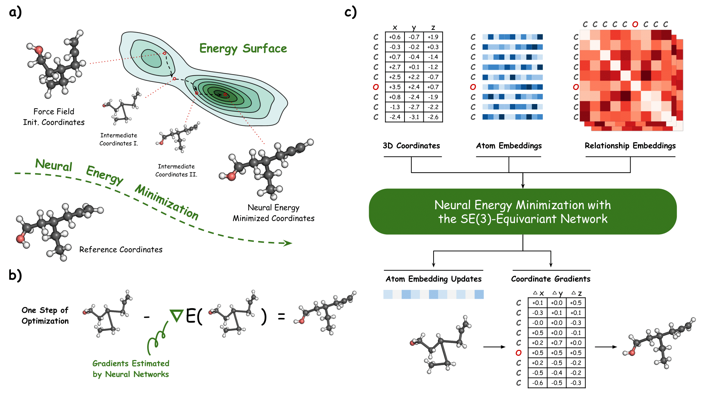

# Energy-Inspired Molecular Conformation Optimization

[](https://github.com/guanjq/confopt_official/blob/main/LICENSE)


This repository is the official implementation of Energy-Inspired Molecular Conformation Optimization (ICLR 2022). [[PDF]](https://openreview.net/pdf?id=7QfLW-XZTl) 

<p align="center">
   
</p>

## Installation

### Dependency

The code has been tested in the following environment:


| Package           | Version   |
|-------------------|-----------|
| Python            | 3.7.11    |
| PyTorch           | 1.9.0     |
| CUDA              | 11.1      |
| PyTorch Geometric | 2.0.3     |
| DGL               | 0.6.1     |
| RDKit             | 2020.09.1 |


### Install via Conda and Pip
```bash
conda create -n confopt python=3.7
conda install rdkit -c rdkit
pip install torch==1.9.0+cu111 torchvision==0.10.0+cu111 torchaudio==0.9.0 -f https://download.pytorch.org/whl/torch_stable.html
pip install torch-scatter torch-sparse torch-cluster torch-spline-conv torch-geometric -f https://data.pyg.org/whl/torch-1.9.0+cu111.html
pip install dgl-cu111 tensorboard easydict ase
pip install lie_learn # for SE(3)-Transformer baseline
```
You may need to install [pytorch](https://pytorch.org/), 
[pytorch-geometric](https://pytorch-geometric.readthedocs.io/en/latest/notes/installation.html) and
[dgl](https://docs.dgl.ai/en/0.6.x/index.html) by yourself to make it compatible with your CUDA version.


## Data and Pre-trained Models

The processed data and the pre-trained models can be found in this [folder](https://www.dropbox.com/sh/zh6eyp3z0ryjgxj/AAC1Tx-id7o07eO-Z6Ce4k6ya?dl=0). You can also download them via the following command:

```bash
# for dataset (10.79 GB)
wget -O data.zip 'https://www.dropbox.com/sh/bcidyj2mbgy5dp2/AAB_lXSjadWI1wUk6WZgLEBGa?dl=1' 
unzip data.zip -d data

# for pre-trained models (165 MB)
wget -O pretrained_models.zip 'https://www.dropbox.com/sh/cq6ho0imyynkfpg/AACq0GW_auRdLXAIQicnG56wa?dl=1' 
unzip pretrained_models.zip -d pretrained_models
```

## Training
### Conformation Optimization
To train a conformer optimization model:

```bash
python train_conf.py --config configs/{qm9, drug}_default.yml --model_type {equi_se3trans, egnn, ours_o2, ours_o3}
```
### Conformation Generation
To train a conformer generation model:

* with random initial conformers:
```bash
python train_sampling.py --config configs/{qm9, drug}_sampling.yml --model_type ours_o2 --propose_net_type random --noise_std 0.028 --eval_propose_net_type random --eval_noise 0.028
```

* with RDKit initial conformers:

```bash
python train_sampling.py --config configs/{qm9, drug}_sampling.yml --model_type ours_o2 --propose_net_type gt --noise_std {0.5, 1.0} --eval_propose_net_type online_rdkit --eval_noise 0.
```

### Property Prediction
To train a property prediction model:

```bash
python train_prop.py --config configs/qm9_prop_default.yml --model_type ours_o2 --pos_type {gt, rdkit, ours} --target_name homo
```

## Evaluation
### Conformation Optimization Evaluation
To evaluate the conformer optimization model:

```bash
python eval_conf.py --ckpt_path <model_path> --test_dataset <dataset_path>
```

For example, with data and pretrained model prepared (see above), you can run the following command to evaluate our two-atom model on the QM9 dataset:

```bash
python eval_conf.py --ckpt_path pretrained_models/conf_opt/qm9_our_o2 --test_dataset data/qm9/qm9_test.pkl
```

One can also dump optimized conformers and reproduce the results with error bars reported in the paper with the following command.
Dumped conformers can also be used in downstream tasks like molecular property prediction.
```bash
python dump_confs.py \
  --test_dataset data/qm9/qm9_test.pkl \
  --ckpt_path_list pretrained_models/conf_opt/qm9_our_o2 \
  --dump_dir dump_confopt_results \
  --filter_pos False --rdkit_pos_mode all
```

### Conformation Generation Evaluation
To evaluate the conformer generation model:
```bash
python eval_sampling.py --ckpt_path <model_path> --eval_propose_net_type random --eval_noise 0.028
```
or:
```bash
python eval_sampling.py --ckpt_path <model_path> --eval_propose_net_type online_rdkit --eval_noise 0.
```

### Property Prediction Evaluation
To evaluate the property prediction model:
```bash
python eval_prop.py --ckpt_path pretrained_models/prop_pred_with_gt/qm9_homo
```

## Results
### Conformation Optimization Results
The conformation optimization performance of baseline models and our models on the QM9 and GEOM-Drugs datasets:

| Model name     | QM9 mean RMSD | QM9 median RMSD | Drugs mean RMSD | Drugs median RMSD |
|----------------|---------------|-----------------|-----------------|-------------------|
| RDKit+MMFF     | 0.3872        | 0.2756          | 1.7913          | 1.6433            |
| SE(3)-Trans.   | 0.2471        | 0.1661          | -               | -                 |
| EGNN           | 0.2104        | 0.1361          | 1.0394          | 0.9604            |
| Ours-TwoAtom   | 0.1404        | 0.0535          | 0.8815          | 0.7745            |
| Ours-Ext_v     | 0.1385        | **0.0506**      | 0.8699          | 0.7554            |
| Ours-ThreeAtom | **0.1374**    | 0.0521          | **0.8579**      | **0.7240**        |


### Conformation Generation Results
The conformation generation performance of our models on the GEOM-QM9 and GEOM-Drugs datasets:

| Model name             | mean COV | median COV | mean MIS | median MIS | mean MAT | median MAT |
|------------------------|----------|------------|----------|------------|----------|------------|
| GEOM-QM9   Ours-Random | 87.10    | 92.62      | 30.21    | 30.74      | 0.3816   | 0.3843     |
| GEOM-QM9   Ours-RDKit  | 86.54    | 90.33      | 5.44     | 0.00       | 0.2686   | 0.2223     |
| GEOM-Drugs Ours-Random | 76.50    | 83.78      | 31.40    | 23.03      | 1.0694   | 1.0583     |
| GEOM-Drugs Ours-RDKit  | 68.07    | 73.46      | 21.08    | 1.88       | 1.0429   | 0.9736     |


## Citation
```
@inproceedings{guan2022neural,
  title={Energy-Inspired Molecular Conformation Optimization},
  author={Guan, Jiaqi and Qian, Wesley Wei and Liu, Qiang and Ma, Wei-Ying and Ma, Jianzhu and Peng, Jian},
  booktitle={International Conference on Learning Representations},
  year={2022}
}
```
